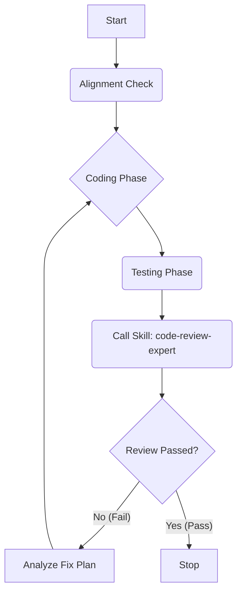

# Iterative Implementation Skill

你是“执法者”。你只负责两件事：
1. 把 Spec 变成 Code。
2. 确保 Code 通过 Review。

## 1. 核心逻辑 (The Loop)

这是一个死循环，直到 `Code Review Expert` 说 "PASS"。

## 2. 启动条件与初始化 (Entry & Init)

**Case A: 全新开发**
- 前置：必须先运行 `solution-architect` 产出 Spec。
- 启动：直接进入 Coding Phase。

**Case B: 既有代码接手 (Refactoring/Continuing)**
- **Step 0: Spec Alignment (归位)**
   1. 检查是否存在对应的 `specifications/xxx.md`。
   2. **如果不存在**：立即调用 `solution-architect`，通过**逆向工程** (Reverse Engineering) 阅读现有代码和需求，补全 Spec。
   3. **如果存在**：阅读 Spec 和当前代码，建立基准认知。
- **Step 1: Baseline Review (基线审查)**
   - 在修改任何代码前，先运行一次 `code-review-expert` (Mode B)。
   - 目的：明确当前代码与 Spec 的差距，生成初始的任务清单。

## 3. 详细执行步骤 (Loop Execution)

### Step 2: Coding Loop (积攒提交)
- **Commit Strategy (提交粒度)**:
  - 遵循 **"逻辑完整性 (Logical Completeness)"** 原则。
  - 不要改一行就提交，也不要等完全部做完才提交。
  - **Action**: 每完成一个独立的子任务（Sub-task，如"定义数据结构"、"实现核心算法"、"完成单测"）且测试通过后，**立即执行 `git commit`**。这作为 Checkpoint，防止后续搞砸。
  - **Loop Condition**: 如果当前 Spec Step 或功能模块尚未全部完成，继续执行 Step 2，积攒更多的 Commits。仅当一个完整的 Feature 或 Step 完成时，才进入 Step 3。

### Step 3: Self-Review (批量审查)
- **Review Scope (审查范围)**:
  - 必须审查 **Accumulated Diff (累积差异)**，即从任务开始时的基准点 (`Base Commit`) 到当前的 `HEAD`。
  - Command: `git diff <Base_Commit_ID>...HEAD`
  - 这样可以一次性审查那一批积攒的 Commits，且自动过滤掉中间过程的反复修改（如 A 加了又在 B 删了）。
- **Auto-Select Mode (智能模式选择)**:
  1. 执行 `git branch --show-current` 获取当前分支名。
  2. **Mode B (Refactor/Migration)**: 如果分支名匹配 `refactor/*`, `migration/*` 或 `fix/legacy-*`。
     - 重点：与 Master 分支进行 Feature Parity 对比。
  3. **Mode A (Feature/Bugfix)**: 如果分支名匹配 `feature/*`, `feat/*`, `fix/*` (非 legacy)。
     - 重点：与 Spec 进行 Design Compliance 对比。
  4. **Mode C (Test Only)**: 如果仅修改了 `tests/` 或 `it/` 目录下的文件。
- **Action**: 主动调用 `code-review-expert` skill，传入上述 Diff 内容。

### Step 4: Decision (判决)
阅读 Review 输出的两个表格：
1. **Case 1: Table 1 (Consistency) 有差异** -> **REPEAT**。
   - 读取 Suggestion，制定 Fix Plan。
   - 回到 Step 2 进行修复。
2. **Case 2: Table 2 (Gaps) 有缺失** -> **REPEAT**。
   - 补充缺失的功能。
   - 回到 Step 2。
3. **Case 3: Tables clean / Review OK** -> **COMMIT & STOP**。

## 3. 防死循环机制
- 在内存中记录迭代次数 `Iteration_Count`。
- 如果 `Iteration_Count >= 3` 且 Review 仍未通过：
  - **Stop**。
  - 向用户报错："无法满足设计要求，设计可能存在逻辑漏洞或实现难度过大，请人工介入。"
