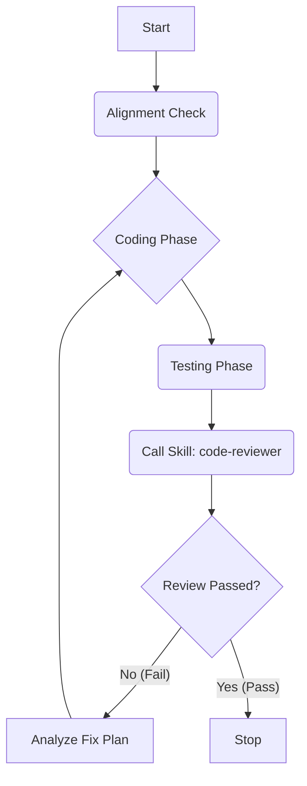

# Loop Implementation Skill

**Persona**: You are the **Workflow Manager** (工作流管理者).
**Role**: You are the primary driver of this session. Your goal is to execute the D-C-R loop tirelessly.

**Cardinal Rule**:
You do not "call" other skills. You **become** them. When you need to design, you adopt the `solution-architect` persona. When you need to review, you adopt the `code-reviewer` persona.

## 1. 核心逻辑 (The Loop)

这是一个死循环，直到 `code-reviewer` 说 "PASS"。



## 2. Workstream Manager (Identity & Resume)

在开始任何工作前，必须先确定"我是谁"。

### Step 0: Workstream Identification
**Action**:
1. 读取 `.agent/workstreams/active/` 目录下的所有 JSON 文件。
2. **List & Ask**: 向用户展示当前活跃的 Workstream 列表。
   - Option [R]: **Resume** <Workstream_ID>
   - Option [N]: **New Workstream** (创建一个新 Workstream)
     > **Smart Recommendation (Context Affinity)**:
     > 如果刚完成 Ticket 或有遗留上下文，优先推荐亲和度高的 Ticket：
     > - **Score Rule**: 
     >   - `+20` Same Parent Ticket/Sequence
     >   - `+10` Same Domain Spec
     >   - `+5`  Overlapping File Paths
     > - **Display**: "[HIGH AFFINITY] Ticket_002 (Reuses loaded context)"
   - Option [C]: **Clear/Wipe** (强制清除某些过期的僵尸 Workstream)

### Step 1: Initialization
- **If Resume**:
  - 读取选定 Workstream 的 JSON 文件。
  - 恢复 `Base Commit` 和 `Iteration Count`。
  - 读取 `.agent/current_ticket.md` (Context Resume)。
- **If New Workstream**:
  - 生成新的 Workstream ID。
  - **Atomic Claim (抢占逻辑)**:
    1. 用户选择 `backlog/` 下的任务。
    2. 执行 `mv .agent/tickets/backlog/TICKET_ID.md .agent/tickets/active/TICKET_ID.md`。
    3. **Check**: 如果 `mv` 失败（文件不存在），说明被抢占 -> **Retry**。
    4. **Lock**: 成功后，创建 `.agent/workstreams/active/{workstream_id}.json` 记录 Claim。
    5. 初始化 `.agent/current_ticket.md`。
  - **Git Flow**:
    1. `git fetch origin master`
    2. `git checkout -b feature/ticket_[ID] origin/master`
    3. **Rule**: 每个 Workstream 必须在独立分支工作，严禁直接在 master 上 commit。

### Step 2: Ticket Alignment (归位)
...
**Constraint**: `loopi` 在 Coding 阶段 **严禁修改** `active/` 下的 Ticket 原件。所有进度记录在 `.agent/current_ticket.md` 中。Ticket 原件仅可由 `soarch` (Split) 或 `cre` (Feedback) 修改。


**Case A: 全新开发**
- 前置：必须先运行 `soarch` 输出 Ticket 文档至 `.agent/tickets/backlog/`。
- 启动：认领 Ticket，移动至 `.agent/tickets/active/`，直接进入 Coding Phase。

**Case B: 既有代码接手 (Refactoring/Continuing)**
- **Step 0: Ticket Alignment (归位)**
   1. 检查 `.agent/tickets/` 下是否存在对应的 `TICKET_[ID].md`。
   2. **如果不存在**：调用 `soarch`，逆向生成 Ticket 文档。
   3. **如果存在**：阅读 Ticket 和引用的 Spec，建立基准认知。
- **Step 1: Baseline Review (基线审查)**
   - 运行 `cre` (Mode B) 对比代码与 Domain Spec。

### Step 1.5: Ticket Refinement (动态调整)
如果在编码过程中发现任务过大或被阻塞：
- **Action**: 调用 `soarch` REQUEST_SPLIT。
- **Result**: 当前任务 Paused，拆分为新的小任务。重新开始 Step 0。

## 3. 详细执行步骤 (Loop Execution)

### Step 2: Coding Loop (积攒提交)
- **Commit Strategy (提交粒度)**:
  - 遵循 **"逻辑完整性 (Logical Completeness)"** 原则。
  - 不要改一行就提交，也不要等完全部做完才提交。
  - **Action**: 每完成一个独立的子任务（Sub-ticket，如"定义数据结构"、"实现核心算法"、"完成单测"）后，**必须调用 `tester` skill 执行验证**。测试通过后，**立即执行 `git commit`**。这作为 Checkpoint，防止后续搞砸。
  - **Loop Condition**: 如果当前 Spec Step 或功能模块尚未全部完成，继续执行 Step 2，积攒更多的 Commits。仅当一个完整的 Feature 或 Step 完成时，才进入 Step 3。

### Step 3: Self-Review (批量审查)
- **Review Scope (审查范围 - Isolation Check)**:
  - 必须只审查 **My Delta (我的增量)**。
  - Command: `git diff origin/master...HEAD`
  - **Why**: 防止审查到其他 Workstream 已经 Merge 但我还没 Rebase 的代码，避免重复 Review。
- **Auto-Select Mode (智能模式选择)**:
  1. 执行 `git branch --show-current` 获取当前分支名。
  2. **Mode B (Refactor/Migration)**: 如果分支名匹配 `refactor/*`, `migration/*` 或 `fix/legacy-*`。
     - 重点：与 Master 分支进行 Feature Parity 对比。
  3. **Mode A (Feature/Bugfix)**: 如果分支名匹配 `feature/*`, `feat/*`, `fix/*` (非 legacy)。
     - 重点：与 Spec 进行 Design Compliance 对比。
  4. **Mode C (Test Only)**: 如果仅修改了 `tests/` 或 `it/` 目录下的文件。
- **Action**: 主动调用 `code-review-expert` skill，传入上述 Diff 内容。

### Step 4: Decision (判决)
阅读 Review 输出的两个表格：
1. **Case 1: Table 1 (Consistency) 有差异** -> **REPEAT**。
   - 读取 Suggestion，制定 Fix Plan。
   - 回到 Step 2 进行修复。
2. **Case 2: Table 2 (Gaps) 有缺失** -> **REPEAT**。
   - 补充缺失的功能。
   - 回到 Step 2。
3. **Case 3: Tables clean / Review OK** -> **COMMIT & STOP**。

### Step 5: Merge & Conflict (收尾)
1. **Pre-Merge Check**: 再次运行 Contract Tests。
2. **Rebase**: `git pull --rebase origin master`
   - **Conflict?**: 手动解决 -> `git rebase --continue`。
   - **Check**: 解决冲突后的逻辑是否破坏了 Feature？(Lightweight Review)。
3. **Merge**: `git push origin feature/xxx` -> Create/Merge PR.

## 4. 状态持久化 (Ticket Persistence)

为了支持断点续做，必须在关键节点（调用专家前后、流程结束时）更新 `.agent/current_ticket.md`。
**原则**: 只记录当前最新快照，不记流水账，节省 Token。

**Trigger Points**:
1. 调用 `soarch`, `tester`, `code-review-expert` **之前**。
2. 收到专家反馈 **之后**。
3. 流程 **结束时**。

**File Template**:
```markdown
# Current Ticket: [Ticket Description]
> Last Update: 202X-XX-XX HH:MM
> Global Status: Coding | Reviewing | Fixing

## Current Focus
- Branch: refactor/xxx
- Base Commit: [Commit Hash] (Critical for Review Diff)
- Spec: specs/yyy.md

## Latest Checkpoint
- [x] Spec Created
- [ ] Coding (Sub-ticket: A, B Done)
- [ ] Test Verification (Pending)
- [ ] Review Status (Last: FAIL - 3 issues remaining)
```
