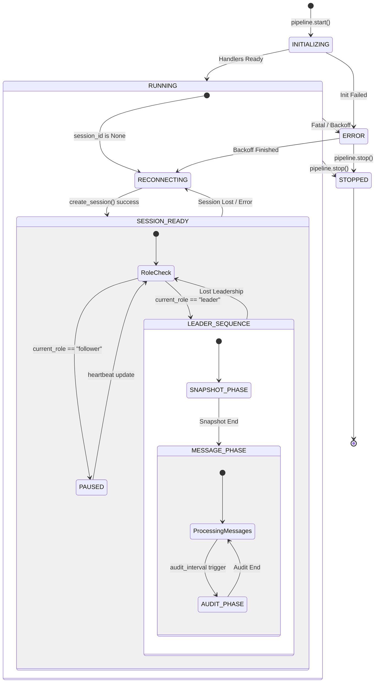

# AgentPipeline State Machine

The Fustor Agent uses an asynchronous state machine managed by `AgentPipeline` to ensure reliable data synchronization and role-based consistency.

## State Diagram (Mermaid)

## Key States Description

| State | Bitmask Flag | Description |
|-------|--------------|-------------|
| **STOPPED** | `0` | Pipeline is inactive and resources are released. |
| **INITIALIZING** | `1` | Loading handlers and preparing networking. |
| **RUNNING** | `2` | Active state. Usually combined with other flags. |
| **PAUSED** | `4` | Follower mode. Pipeline is alive but not pushing data. |
| **ERROR** | `8` | Encountered an exception. Entering backoff logic. |
| **CONF_OUTDATED**| `16` | Configuration changed. Needs restart. |
| **SNAPSHOT_PHASE**| `32` | Performing full data scan. |
| **MESSAGE_PHASE** | `64` | Level-triggered realtime synchronization. |
| **AUDIT_PHASE**   | `128` | Performing periodic consistency check. |
| **RECONNECTING**  | `256` | Attempting to establish session or recover from error. |

## Role Transitions

1. **Follower -> Leader**: Triggered by Fusion when previous leader times out. Agent detects this in Heartbeat response and immediately breaks out of `PAUSED` state to start `LEADER_SEQUENCE`.
2. **Leader -> Follower**: Triggered by Fusion arbitration. Agent cancels all leader tasks (Audit, Sentence, Message Sync) and enters `PAUSED` state.
