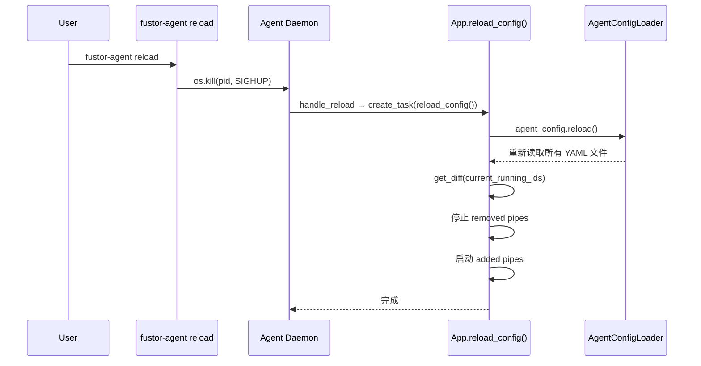
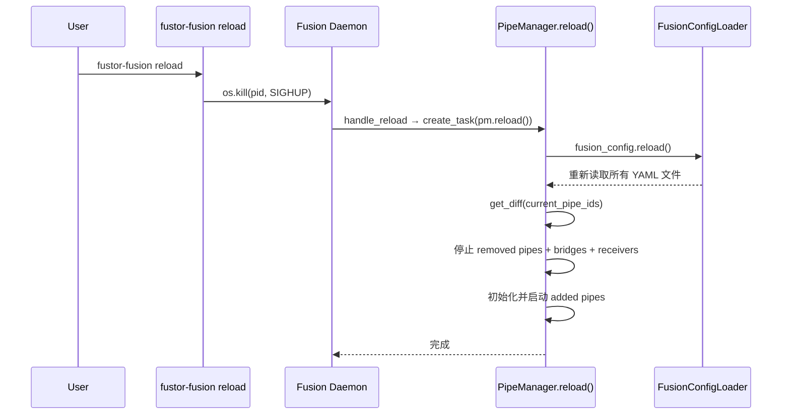

# Fustor 热重载机制 (Hot Reload)

> 版本: 1.0.0  
> 日期: 2026-02-12  
> 状态: 已确认

---

## 1. 概述

Fustor 的 Agent 和 Fusion 均支持 **基于 SIGHUP 信号的配置热重载**，允许在不停止服务的情况下动态增减管道（Pipe）。

> [!IMPORTANT]
> **设计硬约束**：热重载**禁止修改**任何已运行组件（不局限于 Pipe）的配置。只能**增加或删除**组件。
> 若需变更已运行组件的配置（如修改 `fields_mapping`、`source.uri`），必须先删除该组件再重新添加（通过改 Pipe ID 实现，见 §5）。

---

## 2. 使用方式

### 2.1 Agent

```bash
# 修改 YAML 配置后，执行：
fustor-agent reload
```

### 2.2 Fusion

```bash
# 修改 YAML 配置后，执行：
fustor-fusion reload
```

两个命令都是通过读取 PID 文件找到守护进程，然后发送 `SIGHUP` 信号。

---

## 3. 内部执行流程

### 3.1 Agent 热重载



**关键代码路径**：
- CLI 入口: `cli.py` → `reload()` → 发送 SIGHUP
- 信号处理: `runner.py` → `handle_reload()` → `app.reload_config()`
- Diff 逻辑: `app.py` → `reload_config()` → `agent_config.get_diff()`

### 3.2 Fusion 热重载



Fusion 额外处理了 **Receiver 清理**：如果某个端口上的所有 Pipe 都被移除，对应的 HTTP Receiver 也会被停止。

---

## 4. Diff 算法

```python
def get_diff(current_running_ids: Set[str]) -> Dict:
    new_enabled_ids = {id for id, cfg in all_pipes() if not cfg.disabled}
    return {
        "added":   new_enabled_ids - current_running_ids,
        "removed": current_running_ids - new_enabled_ids,
    }
```

| 场景 | added | removed |
|------|-------|---------|
| 新增 pipe YAML | `{new-pipe}` | `{}` |
| 删除 pipe YAML | `{}` | `{old-pipe}` |
| 修改 pipe 配置（同 ID） | `{}` | `{}` ← **不会被检测到** |
| 禁用 pipe（`disabled: true`） | `{}` | `{disabled-pipe}` |

---

## 5. 变更已有 Pipe 配置的操作流程

由于 Diff 算法按 Pipe ID 比较，修改已有 Pipe 的配置需要两步：

### 方式一：改 ID（推荐）

```yaml
# 修改前 (pipe-a.yaml)
pipes:
  my-pipe:
    source: shared-fs
    sender: fusion-main

# 修改后 — 改 ID 让 Diff 检测到
pipes:
  my-pipe-v2:       # ← 新 ID
    source: shared-fs
    sender: fusion-main
    fields_mapping:  # ← 新增配置
      - to: "path"
        source: ["path:string"]
```

然后执行 `fustor-agent reload`。Diff 会检测到 `removed={my-pipe}, added={my-pipe-v2}`。

### 方式二：重启

```bash
fustor-agent stop && fustor-agent start -D
```

---

## 6. FSDriver 单例与热重载

`FSDriver` 使用 `__new__` + `_initialized` 守卫实现单例模式。热重载时的行为：

1. `pipe.stop()` → `driver.close()` → 从 `_instances` 缓存中移除自身
2. 下次 `FSDriver(id, config)` → `__new__` 创建全新实例 → `__init__` 初始化

> [!NOTE]
> `_initialized` 守卫确保同一 URI 的 Driver 不会被重复初始化（防止线程和队列泄漏）。只有 `close()` 清除缓存后，才能创建新实例。
