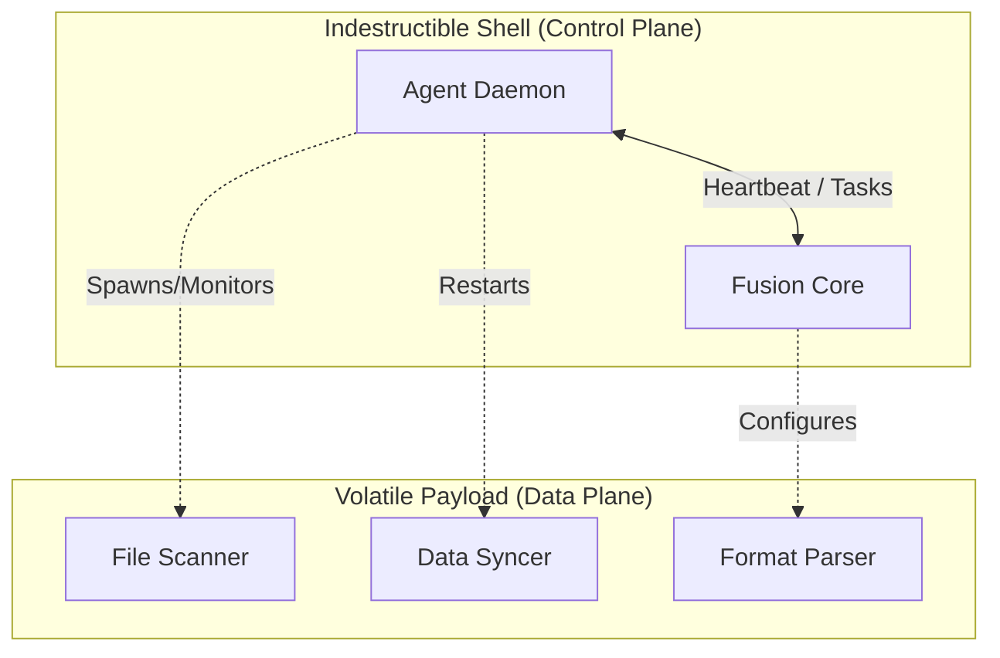

# L0 - Product Vision & Core Philosophy

> "The Control Plane must survive the Data Plane."

## 1. The Core Philosophy: Indestructible Control Plane

The fundamental architectural goal of Fustor is the **absolute decoupling of Control Flow from Data Flow**.

### 1.1 The Survival Mandate
- **Agent Survival**: Once the Agent process starts, it **must never terminate** due to business logic errors, data corruption, or plugin failures. It must essentially be an immortal daemon whose only job is to maintain a lifeline to Fusion.
- **Fusion Survival**: Fusion must remain responsive to heartbeats and administrative commands regardless of the state of data processing pipelines or view consistency logic.

### 1.2 The "Umbilical Cord" Concept
As long as the **Control Plane** (Heartbeat, Task Assignment, Status Reporting) remains intact:
1.  **Self-Repair**: The Control Plane can restart, reset, or reconfigure the crashed Data Plane.
2.  **Hot Upgrades**: The Agent can receive new software versions or bytecode for the Data Plane and apply them without losing connection.
3.  **Config Hot-Reload**: Business logic configurations (which directories to scan, which regex to use) can be updated dynamically to fix issues that caused the Data Plane to crash in the first place.

## 本项目处于关键的核心业务链条上，因此提供的api服务（fs/tree）不可以返回503状态。必须时时刻刻都能提供查询服务。

## 2. Architecture of Separation

To achieve this, the architecture removes **all** business logic from the core Agent/Fusion runtime.

- **The Shell**: Responsible ONLY for authentication, network connectivity (Heartbeat), and process orchestration.
- **The Payload**: Responsible for the actual "work" (FileSystem watching, Database querying, HTTP requests). If the Payload crashes (e.g., Segfault in a native driver, OOM in a parser), the Shell detects it, reports the failure to Fusion, and awaits instructions (Retry, Backoff, or Update Config).

## 3. Benefits

1.  **Zero-Touch Recovery**: No SSH required. If a bad regex crashes the scanner, Fusion can push a corrected regex, and the Agent Shell will restart the scanner with the new config.
2.  **Fault Isolation**: A memory leak in the "View Engine" cannot bring down the "Management API".
3.  **Operational Confidence**: We can deploy aggressive changes to the Data Plane knowing that we can always roll back via the persistent Control Plane.

## 4. Success Criteria
*   The `fustor-agent` process uptime is measured in **months**, even if the `fustor-source-fs` component restarts **daily**.
*   Fusion can diagnose a "Zombie Agent" (Data Plane stuck) via the Control Plane and issue a `kill -9` + `restart` command remotely.
